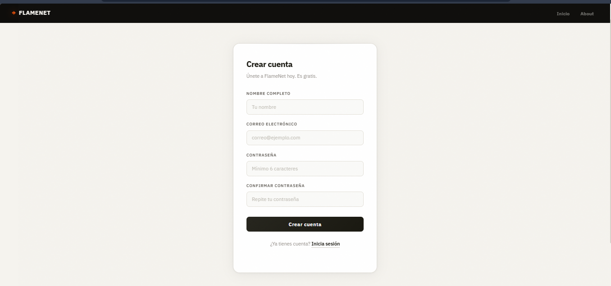
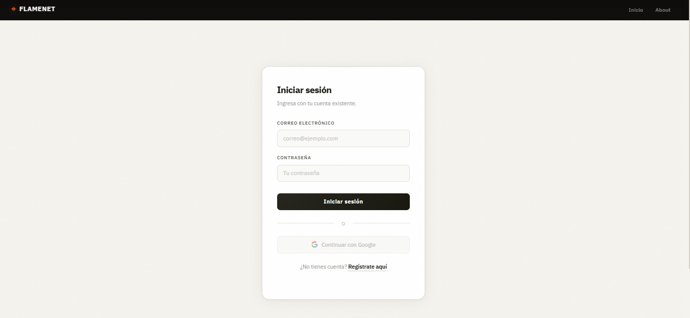
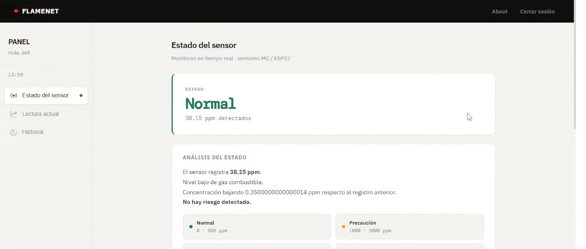
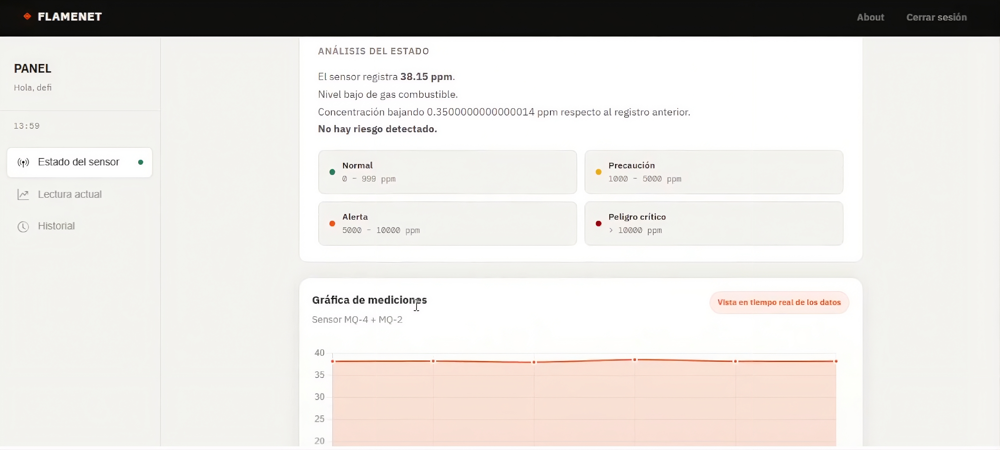
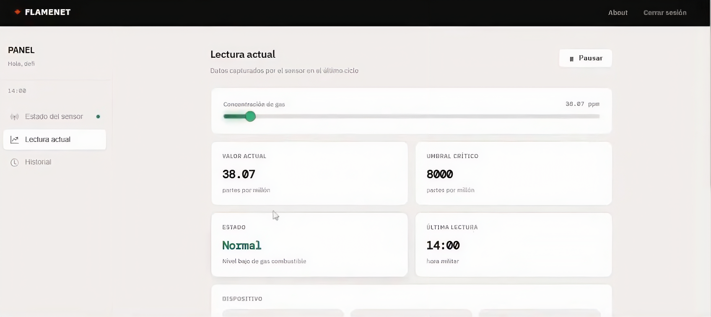
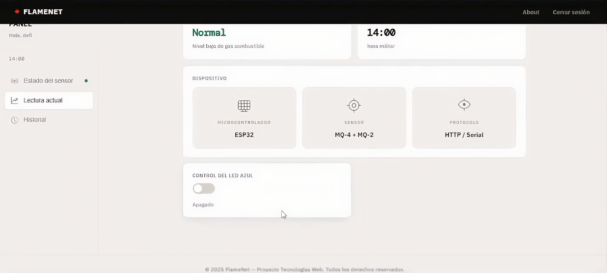
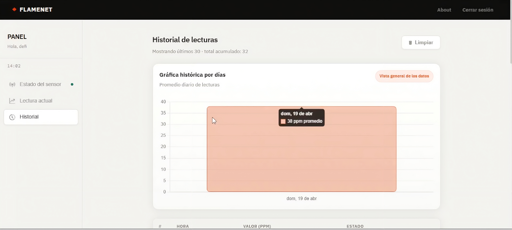
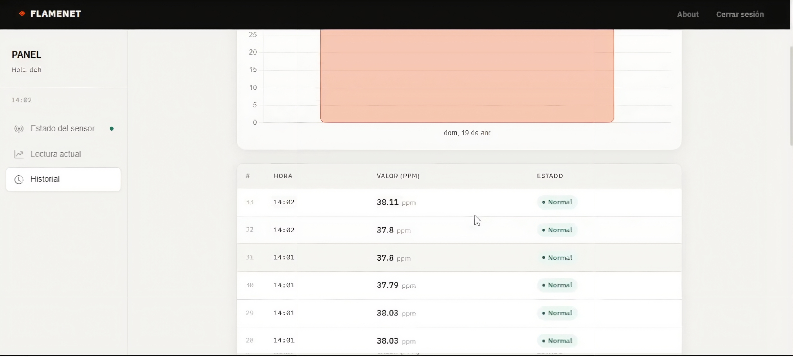
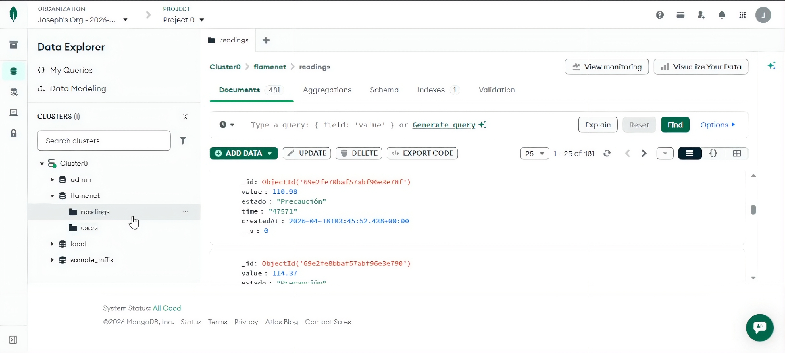
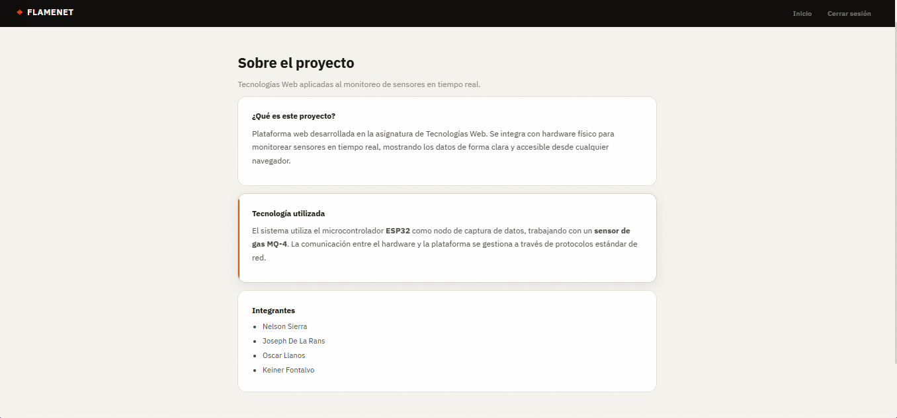

# FlameNet

> Plataforma full-stack conectada con hardware IoT para monitoreo, visualización y gestión de datos en tiempo real.

<p align="center">
  
  
  
  
  
</p>

---

# 📖 Descripción

**FlameNet** es una aplicación full-stack diseñada para integrar una interfaz web moderna con dispositivos IoT basados en ESP32, permitiendo el envío, recepción y visualización de datos en tiempo real.

El proyecto está enfocado en una arquitectura modular y escalable, separando:

- 🌐 Frontend Web
- ⚙️ Backend/API
- 📡 Comunicación con hardware
- 🗄️ Persistencia de datos
- ☁️ Integración de servicios externos

---

# Características principales

- Visualización de datos en tiempo real
- Integración con ESP32
- API REST para comunicación entre servicios
- Envío y recepción de información desde hardware
- Sistema preparado para autenticación y seguridad
- Arquitectura escalable y modular
- Comunicación eficiente entre frontend y backend
- Separación clara de responsabilidades

---

# 🏗️ Arquitectura del proyecto

```bash
Proyectoo/
│
├── frontend/          # Interfaz web
├── backend/           # API y lógica de negocio
├── esp32/             # Código del microcontrolador
├── docs/              # Documentación            # Recursos estáticos
└── README.md
```

---

# 🛠️ Tecnologías utilizadas

## Frontend

- Css / Next.js
- TailwindCSS
- Chart.js / Recharts

## Backend

- Node.js
- Express.js
- MongoDB
- Mongoose
- JWT
- Socket.IO

## IoT / Hardware

- ESP32
- Arduino Framework
- WiFi Manager
- Sensores MQ-4, MQ-2, MQ-135

## DevOps y herramientas

- Git & GitHub
- Postman
- VS Code

---

# 🔌 APIs y comunicación

## API REST

La aplicación utiliza una API REST para conectar el frontend con el backend y permitir la interacción con los dispositivos.

### Ejemplo de endpoints

```http
GET /api/data
POST /api/data
GET /api/status
POST /api/device/connect
```

### Ejemplo de respuesta

```json
{
  "status": "online",
  "temperature": 26.4,
  "humidity": 71
}
```

---

# ⚙️ Variables de entorno

Crea un archivo `.env` en el backend:

```env
PORT=3000
MONGO_URI=your_database_url
JWT_SECRET=your_secret_key
API_URL=http://localhost:3000
```

---

# 🚀 Instalación

## 1️⃣ Clonar el repositorio

```bash
git clone https://github.com/IjossD/Proyectoo.git
cd Proyectoo
```

---

## 2️⃣ Instalar dependencias

### Frontend

```bash
cd frontend
npm install
```

### Backend

```bash
cd backend
npm install
```

---

## 3️⃣ Ejecutar el proyecto

### Backend

```bash
npm run dev
```

### Frontend

```bash
npm run dev
```

---

# 📡 Configuración ESP32

1. Instalar el PlattformIO en vscode
2. Seleccionar la placa ESP32 correspondiente (en nuestro caso el dev module)
3. Configurar credenciales WiFi
4. Configurar URL de la API
5. Subir el firmware contenido en la carpeta esp32/

Ejemplo:

```cpp
const char* ssid = "YOUR_WIFI";
const char* password = "YOUR_PASSWORD";
const char* serverUrl = "http://YOUR_API/api/data";
```

---

# 📷 Capturas del proyecto

Las siguientes capturas muestran los módulos principales de FlameNet y el flujo completo de uso de la plataforma.

## 1. Sign Up



Formulario para crear nuevas cuentas en el sistema. Permite a nuevos usuarios registrarse e iniciar su experiencia en la plataforma FlameNet.

## 2. Login



Pantalla de autenticación. Los usuarios ingresan sus credenciales para acceder al panel de control y funcionalidades de monitoreo.

## 3. Dashboard 1



Vista principal del panel de control. Ofrece un resumen general del estado del sistema con información clave del monitoreo en tiempo real.

## 4. Dashboard 2 - Gráfica de mediciones



Sección de visualización de métricas con gráficos en tiempo real. Permite identificar patrones y tendencias en los valores capturados por los sensores.

## 5. Lectura 1 - Datos y umbrales



Muestra el valor actual del sensor, estado operativo y umbrales configurados. Proporciona información detallada de cada medición con indicadores visuales de normalidad.

## 6. Lectura 2 - Control del LED



Panel de control remoto del LED conectado al ESP32. Permite activar o desactivar el LED desde la interfaz web para pruebas y automatización.

## 7. Historial 1 - Gráfica histórica



Visualización gráfica del histórico de mediciones por días. Facilita el análisis de tendencias a largo plazo y comportamiento del sistema.

## 8. Historial 2 - Tabla de datos



Tabla detallada del historial con columnas: Hora, Valor (ppm) y Estado. Permite revisar cada medición individual de forma estructurada.

## 9. Base de datos MongoDB



Captura de la base de datos MongoDB mostrando las colecciones de usuarios, lecturas y configuraciones del sistema.

## 10. Sección About Us



Página de información del proyecto. Presenta detalles sobre FlameNet, el equipo de desarrollo y el propósito de la plataforma.

---

# 🔄 Flujo del sistema

```text
ESP32 → API REST → Base de datos → Backend → Frontend
```

---

# 📚 Roadmap

- [ ] Sistema de autenticación
- [ ] Dashboard avanzado
- [ ] WebSockets en tiempo real
- [ ] Notificaciones
- [ ] Dockerización
- [ ] Despliegue en la nube
- [ ] Integración de más sensores

---

# 🧪 Testing

```bash
npm run test
```

---

# 🤝 Contribuciones

Las contribuciones son bienvenidas.

1. Fork del proyecto
2. Crear rama:

```bash
git checkout -b feature/nueva-funcionalidad
```

3. Commit:

```bash
git commit -m "feat: nueva funcionalidad"
```

4. Push:

```bash
git push origin feature/nueva-funcionalidad
```

5. Crear Pull Request

---

# 👨‍💻 Autores

- Oscar Llanos
- Nelson Sierra
- Joseph De La Rans

---

# 📄 Licencia

Este proyecto está bajo el dominio de la Grasa.

---

# ⭐ Support

Si te gustó el proyecto:

- Dale una ⭐ al repositorio
- Comparte el proyecto
- Contribuye con mejoras

---

<p align="center">
  Made with ❤️ and lots of coffee.
</p>
